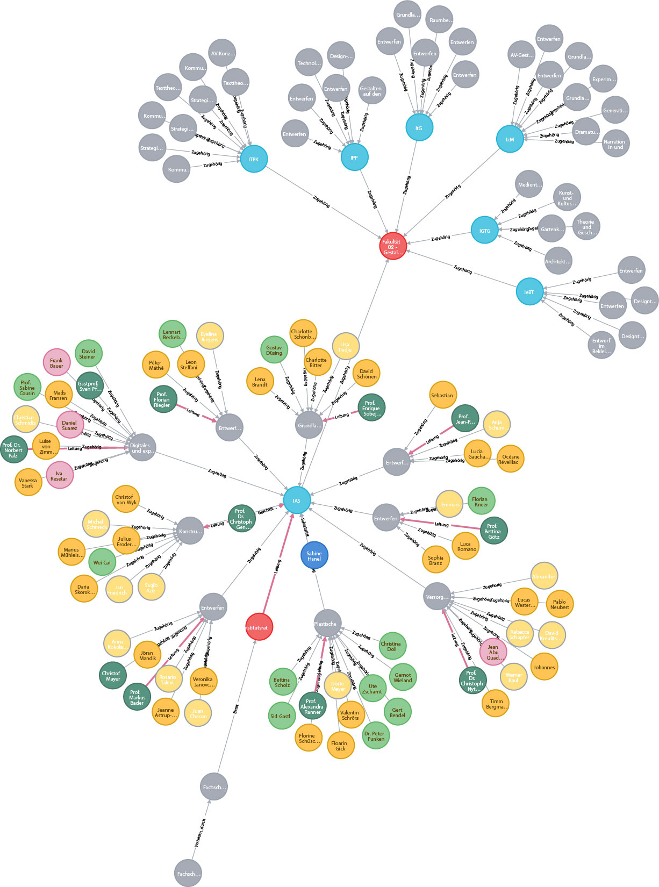
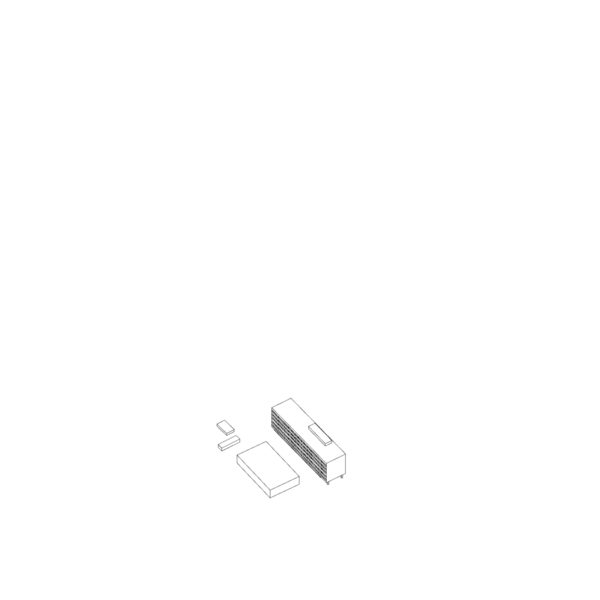

# udk-graph
udk-graph (Arbeitstitel) ist ein Werkzeug zur Abbildung der UdK-Organisation und des universitär verankerten/produzierten Wissens in räumlicher Graphenform. 
Eine Universität ist eine räumlich-institutionelle Bindung vielfältiger Kompetenzen. Diese Kompetenzen funktionieren autark aber stehen vielfach auch in engem inhaltlichem Zusammenhang. Inhaltliche und kommunikative Transparenz oder gar Synergien aus dieser Nähe zu entwickeln, ist eine Herausforderung, deren Bewältigbarkeit vor dem Hintergrund zeitgenössischer Möglichkeiten der visuellen und strukturellen Aufarbeitung von Informationen neu bewertet werden muss. Im Sinne einer nachhaltigen und gemeinwohlorientierten Erzeugung und Verwaltung künstlerischer und wissenschaftlicher Kompetenz, sollte sich eine Universität heute im gleichen Maße als institutionelles Datenframework, wie als Institution der raumgebundenen Kompetenzanreicherung verstehen. 
Im Rahmen des Projekts soll die angesprochene Neuberwertung mittels einer Webapplikation angestoßen werden. Es soll eine Schnittstelle zum Framework UdK gebildet werden, die für gezielte inhaltliche oder Strukturelle Anfragen dient. Dabei gilt besondere Aufmerksamkeit einer ganzheitlichen und intuitiven Abbildung der vorhandenen Strukturen aber auch der Sichtbarmachung von universitätsinhärenten Meta Daten.

# Szenarien
Der Nutzen des Vorhabens ist im Folgenden anhand einer Reihe von Nutzungszenarien dargestellt:
1. Präsentation und Transparenz
2. Kommunikation (intern/extern)
3. Forschungssynergien
4. Archiv
5. Gebäudemanagement
6. Qualitätssicherung/Controling

## Präsentation und Transparenz

Als interaktive Schnittstelle kann die Anwewndung die Möglichkeit bieten die Hochschule für Studierende und Lehrende, Verwaltung, Alumni und auch Externe räumlich abzubilden. Mit einem modellgebunden Graphen können hochschulorganisatorische Daten intuitiv und standortbezogene dargestellt werden. Es bietet sich die Möglichkeit dynamischer Neuordnung, je nach Betrachtungsschwerpunkt. Besonders interessant ist diese Form der Präsentation beispielsweise für die Außendarstellung der International Affairs oder auch für die Studiengänge in der Kommunikation mit potenzielle BewerberInnen. Darüber hinaus dient eine ganzheitliche Darstellung auch intern zur zentralen Information über die Zusammensetzung von Studiengängen, Gremien oder auch Verwaltungsabteilungen. 
Bei einer Nutzung für die Außendarstellung ist es besonders wichtig, Stabilität und Kompatibilität Software- und Hardwareseitig zu gewährleisten, sowie für eine geringe Vulnerabilität zu sorgen.

## Kommunikation

Durch die filterbare ganzheitliche Abbildung der Universität ergeben sich zwei eindeutige Gewinne für die interne Kommunikation: Erstens werden Informationsdefizite über strukturelle Zusammenhänge durch die einfache Zugänglichkeit der Informationen vermindert und zweitens können bestimmte Personengruppen oder Ansprechpartner z.B. nach Standort oder auch Geschlecht sehr unmittelbar und nicht-linear zu Addressatengruppen gebündelt werden. So bildet sich eine Intuitive Kommunikationsplatform, die von Studierenden, Lehrenden, Verwaltung und Alumni genutzt werden kann. Die Vereinbarkeit mit gültigen Datenschutzbestimmungen muss überprüft werden.

## Forschungssynergien

Existiert ein Netzwerk, dass die universitäre Lehrstruktur abbildet, ist es auch möglich diesen Lehrstrukturen Forschungsarbeiten oder auch künstlerische Arbeiten formal zuzuordnen. Über eine gewissenhafte Verschlagwortung wäre es Möglich, Studiengangsübergreifende thematische Überlappungen offenzulegen und neue Dialoge zu eröffnen. Wer forscht an den gleichen Themen? Gibt es eine universitäre Forschungshistorie zu einem Thema? Gibt es Zeitgebundene Thementrends? Lehrende, Studierende, DoktorandInnen und potenziell auch andere Hochschulen können so einfache inhaltliche Anknüpfungspunkte und die zugehörigen Kontakte finden.
Ein solches Wissensnetzwerk lebt von seinen Daten. Um den Erfolg und die Nachhaltigkeit zu gewährleisten wäre es notwendig, Abgaben bzw. Veröffentlichungen von Arbeiten gezielt mit dem System interferrieren zu lassen und es zum integralen Bestandteil des Universitätsalltags zu machen. Dabei ist es wichtig, dass bei Lehrenden und Studierenden keine zusätzliche bürokratische Arbeit entsteht, sondern, im Gegenteil, Prozesse durch einfache digitalen Datenaustausch vereinfacht werden.

## Archiv

Betrachtet man die digitale Akkumulation von künstlerischen und wissenschaftlichen Arbeiten unter Verwendung eines Verschlagwortungssystems über einen längeren Zeitraum, ergibt sich automatisch ein digitales Archiv, das von Verwaltung, Studierenden und Lehrenden genutzt werden kann. Es ist zu prüfen, inwieweit eine Migration des bestehenden UdK Archivkatalogs durchgeführt werden könnte und welche Bedarfe dort konkret für eine solche Anwendung schon vorhanden sind. Ein digitales Archiv, das aktiv an die grafische Repräsentation der Hochschulstruktur gebunden ist, ermöglicht potenziell einen anderen, unmittelbareren Zugang zu seinen Inhalten. Langfristig, ist mit einer anhäufung großer Datenmengen zu rechnen für die es frühzeitung ein Konzept zu entwickeln gilt; sowohl in Hinsicht auf Kapazitäten aber auch auf Performanz in der Darstellung.
Ein weiterer Punkt ist die Archivierung struktureller Veränderungen in der Universität. Es gilt zu überprüfen, ob für Änderungen in beispielsweise der Fakultätsorganisation oder personelle Chronologie eine zugängliche Darstellungsform ermöglicht werden kann.

## Gebäudemanagement
Im Rahmen einer räumlich-vernetzten Darstellung der UdK Standorte liegt eine Verknüpfung mit den Tätigkeiten des Gebäudemanagements/GA nahe. Über ein digitales Raumbuch kann ein schneller und informationsreicher Zugriff auf räumlichkeiten und haustechnische Einrichtungen gewährleistet werden und beispielsweise digitale Schadensmeldungen automatisch kartiert werden.

## Qualitätssicherung / Controling 

Langfristig wäre eine Abbildung der Vorgangsstruktur der UdK denkbar. D.h. eine präzise Abbildung welchen Weg beispielsweise ein Dienstreiseantrag oder eine Sachmittelbestellung nimmt. Über eine grafische Darstellung der Vorgänge, ließen sich ggF. Prozesse mit besonders vielen Schnittstellenübergängen identifizieren und optimieren.

# Herausforderungen und Risiken
Übergeordnete Herausforderungen bilden vor allem die Wartung, Administration und Skalierbarkeit des Systems. Hier sind frühzeitig nachhaltige Lösungen zu bedenken.

# Roadmap

Mai | Juni | Juli | August | September | Oktober | November | Dezember
----|------|------|--------|-----------|---------|----------|---------
Komplette Abbildung des Architekturstudiengangs|Komplette Abbildung der Fakultät 2|Funktionsfähiger Prototyp webGL Graph|Grapheninteraktion, Anlegen von Knoten mit Eigenschaften sowie Relationen|Funktionsfähiger Prototyp webGL Gebäudemodell|Funktionsfähiger Prototyp webGL Gebäudemodell + Graph|Upload-Interface für wissensch. und künstler. Arbeiten|...
...|...|...|...|...|...|...|...|

## Unsortierte Milestones

- Komplette Abbildung der Fakultäten
- Komplette Abbildung der Gremienstruktur
- Komplette Abbildung der Verwaltung

# Zum aktuellen Stand
Das Projekt wird als NodeJS Anwendung ausgeführt. Voraussichtlich wird die benutzte Datenbanklösung neo4j.com sein. Für die grafische Repräsentation wird eine Kombination aus three.js für die Gebäudemodelle und vasturiano.github.io/3d-force-graph dienen.

Im aktuellen Stand funktioniert die grundsätzliche Client-Server/DB Interaktion. Der Graph wird mittels webGL abgebildet und ist nach grundlegenden Labeln strukturell filterbar. Im nächsten Schritt soll eine Meta-Daten Filterung ermöglicht werden (z.B. Geschlechter, Forschungsinhalte...).
